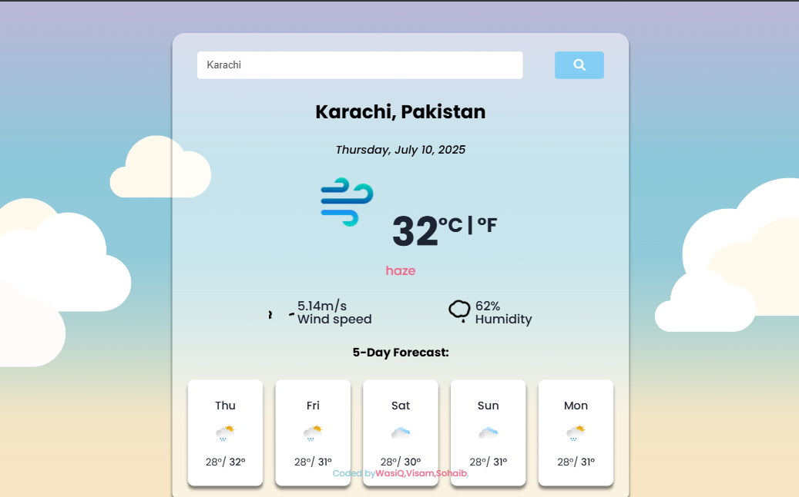

# React Weather App



A simple and modern weather application built with React. This app allows users to search for current weather information for any city using a clean and responsive interface.

## Features

- Search for weather by city name
- Displays temperature, weather conditions, and icons
- Responsive design for desktop and mobile
- Uses [OpenWeatherMap API](https://openweathermap.org/api) (or your chosen weather API)
- Built with React and modern JavaScript

## Installation

1. **Clone the repository:**
   ```bash
   git clone https://github.com/Visam-dev/React-WeatherApp.git
   cd React-WeatherApp
   ```

2. **Install dependencies:**
   ```bash
   npm install
   ```

3. **Start the development server:**
   ```bash
   npm start
   ```

## Usage

- Enter a city name in the search bar and press enter.
- View the current weather details for the selected city.

## Technologies Used

- React
- Axios
- FontAwesome Icons
- React Icons
- CSS

## Folder Structure

```
/src
  /components
  /assets
  App.js
  index.js
package.json
README.md
```

## Customization

- To use your own weather API key, update the API key in the relevant source file (src/components/App.js).

## License

This project is open source and available under the [MIT License](LICENSE).

---

*Feel free to contribute or open issues!*